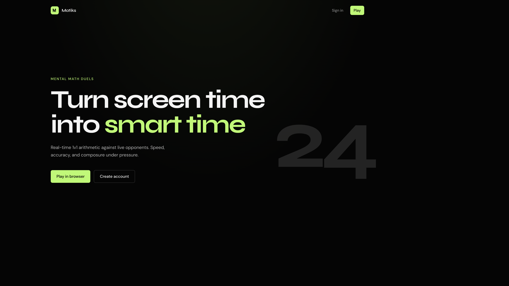
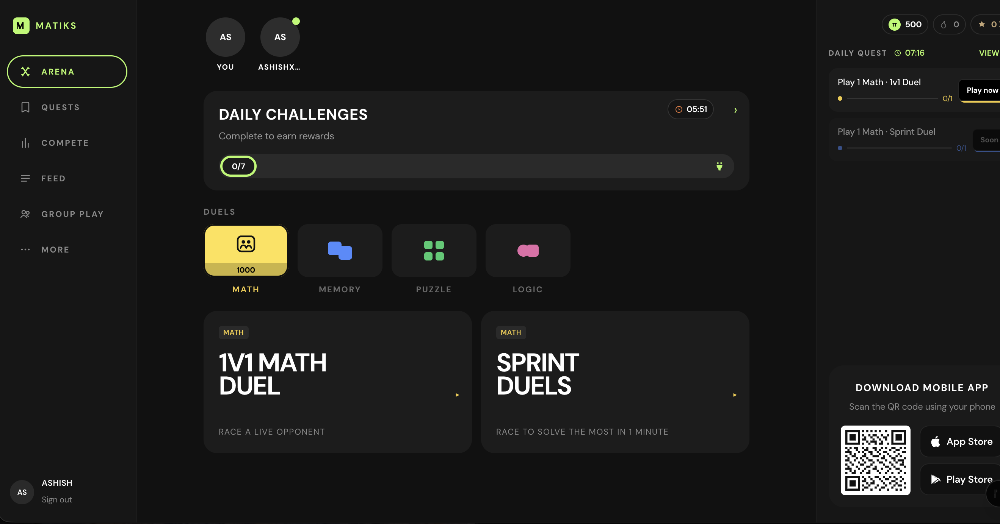
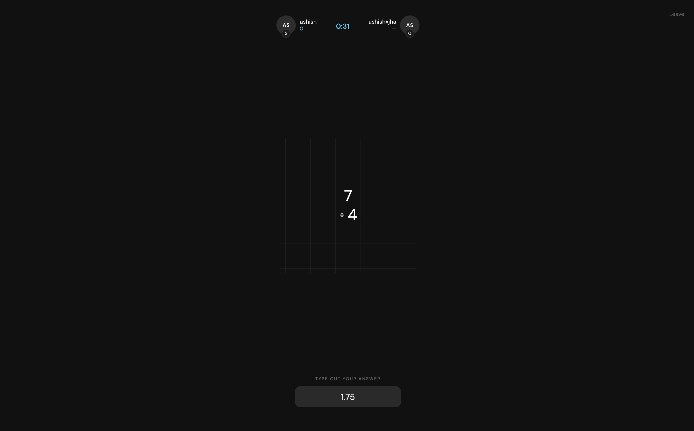
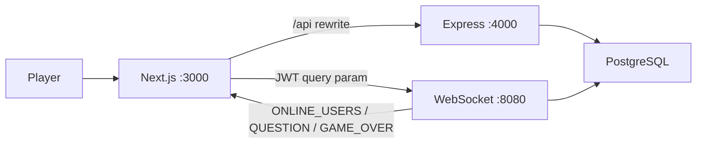

<p align="center">
  
</p>

<p align="center">
  
</p>

<h1 align="center">Matiks</h1>

<p align="center">
  <strong>Turn screen time into smart time.</strong><br />
  Realtime 1v1 mental math duels. Queue with players online, race through arithmetic under a 60-second clock, and see who solves faster.
</p>

<p align="center">
  <a href="https://github.com/ashishxjhaa/matiks">
    
  </a>
  &nbsp;
  <a href="https://github.com/ashishxjhaa/matiks">
    
  </a>
  &nbsp;
  <a href="https://github.com/ashishxjhaa/matiks">
    
  </a>
  &nbsp;
  <a href="https://github.com/ashishxjhaa/matiks/issues">
    
  </a>
</p>

<p align="center">
  
  
  
  
  
  
  
  
  
</p>

<p align="center">
  <a href="#features"><strong>Features</strong></a>
  ·
  <a href="#getting-started"><strong>Getting Started</strong></a>
  ·
  <a href="#architecture"><strong>Architecture</strong></a>
  ·
  <a href="#docker"><strong>Docker</strong></a>
  ·
  <a href="https://ashishjha.xyz/"><strong>Author</strong></a>
</p>

---

## Why Matiks?

Most math apps are drills against a timer. Matiks is a **live arena**: you see who is online, queue for a match, and race a real opponent through `+ − × ÷` until the clock hits zero.

Built as a full-stack realtime product: JWT auth, live presence, matchmaking, per-player question progress, and a results screen when the sprint ends.

---

## Features

| | |
| :--- | :--- |
| **1v1 sprint duels** | Sixty seconds. First player to queue opens a room; the next player locks in and the clock starts. |
| **Live matchmaking** | Find a match from the dashboard. Other clients see a join request while you wait on the radar screen. |
| **Online presence** | The WebSocket server broadcasts who is connected so the lobby stays honest. |
| **Four operations** | Addition, subtraction, multiplication, and division, including decimal answers like `1.75`. |
| **Independent progress** | Correct answers advance *your* next question. Wrong answers keep you still. The opponent has their own stack. |
| **On-screen keypad** | Type or tap. Decimals and negatives are allowed; floating-point answers compare with a tight tolerance. |
| **Game over modal** | When time expires, both players get scores and ratings in the same result card. |
| **Email auth** | Register and log in with JWT. Passwords are bcrypt-hashed. |

---

## Screenshots

<p align="center">
  
</p>
<p align="center"><em>Landing: queue for a duel and turn screen time into smart time</em></p>

<p align="center">
  
</p>
<p align="center"><em>Dashboard: arena, daily challenges, duel tiles, and who's online</em></p>

<p align="center">
  
</p>
<p align="center"><em>Duel: HUD, live scores, 60s clock, question chip, and keypad</em></p>

---

## Tech Stack

| Layer | Stack |
| :--- | :--- |
| **Web** | Next.js 16 (App Router), React 19, Tailwind CSS 4, React Compiler |
| **API** | Bun + Express 5, Zod validation, JWT Bearer tokens |
| **Realtime** | `ws` server on `:8080`: presence, matchmaking, questions, scores |
| **Data** | Prisma 7, PostgreSQL 16 |
| **Auth** | bcryptjs password hashing |
| **Monorepo** | Turborepo + Bun workspaces |
| **Run** | Docker Compose (frontend, backend, websocket, Postgres) |

---

## Architecture

```text
matiks/
├── apps/
│   ├── frontend/   # Next.js App Router  → :3000
│   ├── backend/    # Bun + Express API   → :4000  (/api/v1/auth)
│   └── ws/         # WebSocket arena     → :8080
├── packages/
│   ├── common/     # Shared Zod schemas
│   ├── db/         # Prisma client + migrations
│   └── ui/         # Shared UI stubs
├── docs/images/    # README screenshots
├── docker-compose.yml
└── package.json
```

| Service | Role |
| :--- | :--- |
| `apps/frontend` | Landing, auth, dashboard, game arena. Proxies `/api/*` to the backend. |
| `apps/backend` | Register, login, `/me`. Issues JWTs. |
| `apps/ws` | Online users, find/join match, questions, scoring, 60s `GAME_OVER`. |
| `packages/db` | Prisma models: users, ratings, games, questions, friends. |
| Postgres | Source of truth for accounts and ratings. Live games stay in memory on the WS process. |



1. **Auth.** `POST /api/v1/auth/register` or `/login`. The client stores the JWT and sends it on API calls and on the WebSocket URL (`?token=`).
2. **Lobby.** A connected socket is added to `onlineUsers` and every client receives `ONLINE_USERS`.
3. **Match.** `PLAY_GAME` either opens a `SEARCHING_FOR_PLAYER` room (`GAME_REQUEST` to others) or joins it, generates ~60 questions, and starts the timer.
4. **Play.** `SUBMIT_ANSWER` is checked with a `1e-6` numeric tolerance. A hit increments that player's score and sends them the next `QUESTION`.
5. **End.** After 60 seconds, `finishGame` loads ratings from Postgres and broadcasts `GAME_OVER`.

---

## Getting Started

### Prerequisites

- [Bun](https://bun.sh) `>= 1.3`
- Node.js `>= 24`
- PostgreSQL (local or Docker)
- Docker (optional, for Compose)

### Install

```bash
git clone https://github.com/ashishxjhaa/matiks.git
cd matiks
bun install
```

### Environment

```bash
cp .env.example .env
```

Point `DATABASE_URL` at your Postgres instance and set `JWT_SECRET`.

### Database

```bash
bun run db:generate
bun run db:migrate
```

### Run locally

```bash
bun run dev
```

Or separately:

```bash
cd apps/backend && bun run dev    # http://localhost:4000
cd apps/ws && bun run dev         # ws://localhost:8080
cd apps/frontend && bun run dev   # http://localhost:3000
```

Open [http://localhost:3000](http://localhost:3000). Sign up, open the dashboard, find a match (a second browser / incognito session is the easiest way to duel yourself).

---

## Docker

```bash
cp .env.example .env
docker compose up --build
```

| Service | URL |
| :--- | :--- |
| Frontend | http://localhost:3000 |
| API | http://localhost:4000 |
| WebSocket | ws://localhost:8080 |
| Postgres | localhost:5432 |

Compose waits for Postgres health, runs Prisma migrate on the backend, then starts the API, WS server, and Next.js app. Override `JWT_SECRET` in `.env` before using this anywhere public.

---

## Environment Variables

From `.env.example`:

| Variable | Where | Purpose |
| :--- | :--- | :--- |
| `DATABASE_URL` | backend, ws, Prisma | Postgres connection string |
| `JWT_SECRET` | backend, ws | Sign and verify auth tokens |
| `PORT` | backend | API port (default `4000`) |
| `WS_PORT` | ws | WebSocket port (default `8080`) |
| `API_ORIGIN` | frontend (Next rewrites) | Backend origin. Local: `http://localhost:4000`. Compose: `http://backend:4000` |
| `NEXT_PUBLIC_WS_URL` | frontend | Browser WebSocket URL (default `ws://localhost:8080`) |

---

## Scripts

| Command | Description |
| :--- | :--- |
| `bun run dev` | Start frontend, backend, and ws via Turborepo |
| `bun run build` | Production build across the monorepo |
| `bun run lint` | Lint all packages |
| `bun run check-types` | Typecheck all packages |
| `bun run db:generate` | Generate Prisma Client |
| `bun run db:migrate` | Apply Prisma migrations |

---

## Routes

| Route | Auth | Description |
| :--- | :--- | :--- |
| `/` | Public | Landing page |
| `/auth` | Public | Register / sign in |
| `/dashboard` | Required | Arena, presence, find / join match |
| `/game` | Required | Searching radar, live duel, results |

---

## API

Auth lives under `/api/v1/auth`. The Next.js app rewrites `/api/*` to the backend.

| Method | Path | Body |
| :--- | :--- | :--- |
| `POST` | `/api/v1/auth/register` | `{ email, password }` |
| `POST` | `/api/v1/auth/login` | `{ email, password }` → `{ token }` |
| `GET` | `/api/v1/auth/me` | Bearer token → current user + rating |

---

## WebSocket

Connect to `ws://localhost:8080?token=<jwt>`.

**Client → server**

| Type | Payload | When |
| :--- | :--- | :--- |
| `PLAY_GAME` | `{}` | Find or join a match |
| `SUBMIT_ANSWER` | `{ gameId, questionId, answer }` | Submit a numeric answer |

**Server → client**

| Type | Payload | When |
| :--- | :--- | :--- |
| `ONLINE_USERS` | `{ user }` | Presence snapshot |
| `GAME_REQUEST` | `{ gameId }` | Someone is waiting to duel |
| `QUESTION` | `{ gameId, question }` | Match start or next problem |
| `GAME_OVER` | `{ gameId, players }` | Timer expired: scores + ratings |

---

## Author

**Ashish Jha**

<p>
  <a href="https://ashishjha.xyz/">
    
  </a>
  &nbsp;
  <a href="https://github.com/ashishxjhaa">
    
  </a>
  &nbsp;
  <a href="https://x.com/ashishxjha">
    
  </a>
  &nbsp;
  <a href="https://www.linkedin.com/in/ashishxjha/">
    
  </a>
</p>

---

<p align="center">
  <a href="https://github.com/ashishxjhaa/matiks">
    
  </a>
</p>
